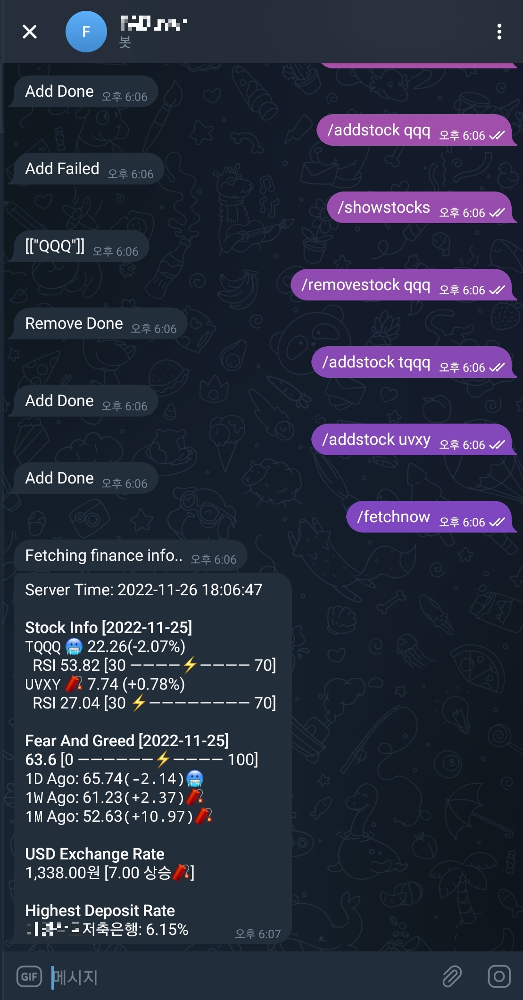

<p align="center">
  
</p>

# Finance Telegram Bot
<p align="center">
  
</p>
 
## Features
1. Fetch information of the stock you registered.
2. Fetch `Fear and Greed` value from CNN site.
3. Fetch USD Exchange Rate from `Naver Finance`.
4. Fetch highest deposit rate and get bank name and value.
5. Type `/fetchnow` to fetch immediately.

## Data Sources
* `Stock Info`: [Yahoo Finance](https://finance.yahoo.com)
* `Fear and Greed`: [CNN Fear and Greed Index](https://edition.cnn.com/markets/fear-and-greed)
* `USD Exchange Rate`: [Naver Finance](https://finance.naver.com/marketindex/exchangeDetail.naver?marketindexCd=FX_USDKRW#)
* `Highest Deposit Rate`: [Financial Supervisory Service](https://finlife.fss.or.kr/deposit/selectDeposit.do?menuId=2000100)

## How does work
* Running at 7AM daily with python schedule library.
* Pooling messages from telegram while running this app and execute commands.
* Save user info in `SQLite`.

## How to install
1. Go to [Link](https://github.com/TA-Lib/ta-lib-python#windows) to install `TA-Lib` binary.
2. After install library, run
```bash
pip3 install -r requirements.txt
pip3 install TA-Lib
```
  
> @Poxios, 2022